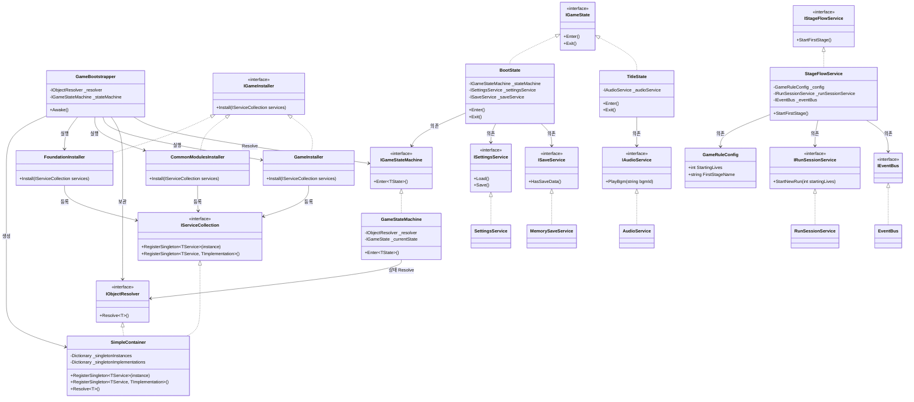

```mermaid
classDiagram
direction TB

class GameBootstrapper {
  -IObjectResolver _resolver
  -IGameStateMachine _stateMachine
  +Awake()
}

class IServiceCollection {
  <<interface>>
  +RegisterSingleton~TService~(instance)
  +RegisterSingleton~TService, TImplementation~()
}

class IObjectResolver {
  <<interface>>
  +Resolve~T~()
}

class SimpleContainer {
  -Dictionary<Type, object> _singletonInstances
  -Dictionary<Type, Type> _singletonImplementations
  +RegisterSingleton~TService~(instance)
  +RegisterSingleton~TService, TImplementation~()
  +Resolve~T~()
}

class IGameInstaller {
  <<interface>>
  +Install(IServiceCollection services)
}

class FoundationInstaller {
  +Install(IServiceCollection services)
}

class CommonModulesInstaller {
  +Install(IServiceCollection services)
}

class GameInstaller {
  +Install(IServiceCollection services)
}

class IGameStateMachine {
  <<interface>>
  +Enter~TState~()
}

class GameStateMachine {
  -IObjectResolver _resolver
  -IGameState _currentState
  +Enter~TState~()
}

class IGameState {
  <<interface>>
  +Enter()
  +Exit()
}

class BootState {
  -IGameStateMachine _stateMachine
  -ISettingsService _settingsService
  -ISaveService _saveService
  +Enter()
  +Exit()
}

class TitleState {
  -IAudioService _audioService
  +Enter()
  +Exit()
}

class IEventBus {
  <<interface>>
}

class EventBus

class ISettingsService {
  <<interface>>
  +Load()
  +Save()
}

class SettingsService

class IAudioService {
  <<interface>>
  +PlayBgm(string bgmId)
}

class AudioService

class ISaveService {
  <<interface>>
  +HasSaveData()
}

class MemorySaveService

class GameRuleConfig {
  +int StartingLives
  +string FirstStageName
}

class IRunSessionService {
  <<interface>>
  +StartNewRun(int startingLives)
}

class RunSessionService

class IStageFlowService {
  <<interface>>
  +StartFirstStage()
}

class StageFlowService {
  -GameRuleConfig _config
  -IRunSessionService _runSessionService
  -IEventBus _eventBus
  +StartFirstStage()
}

IServiceCollection <|.. SimpleContainer
IObjectResolver <|.. SimpleContainer
IGameInstaller <|.. FoundationInstaller
IGameInstaller <|.. CommonModulesInstaller
IGameInstaller <|.. GameInstaller
IGameStateMachine <|.. GameStateMachine
IGameState <|.. BootState
IGameState <|.. TitleState
IEventBus <|.. EventBus
ISettingsService <|.. SettingsService
IAudioService <|.. AudioService
ISaveService <|.. MemorySaveService
IRunSessionService <|.. RunSessionService
IStageFlowService <|.. StageFlowService

GameBootstrapper --> SimpleContainer : 생성
GameBootstrapper --> FoundationInstaller : 실행
GameBootstrapper --> CommonModulesInstaller : 실행
GameBootstrapper --> GameInstaller : 실행
GameBootstrapper --> IObjectResolver : 보관
GameBootstrapper --> IGameStateMachine : Resolve

FoundationInstaller --> IServiceCollection : 등록
CommonModulesInstaller --> IServiceCollection : 등록
GameInstaller --> IServiceCollection : 등록

GameStateMachine --> IObjectResolver : 상태 Resolve
BootState --> IGameStateMachine : 의존
BootState --> ISettingsService : 의존
BootState --> ISaveService : 의존
TitleState --> IAudioService : 의존

StageFlowService --> GameRuleConfig : 의존
StageFlowService --> IRunSessionService : 의존
StageFlowService --> IEventBus : 의존

```
